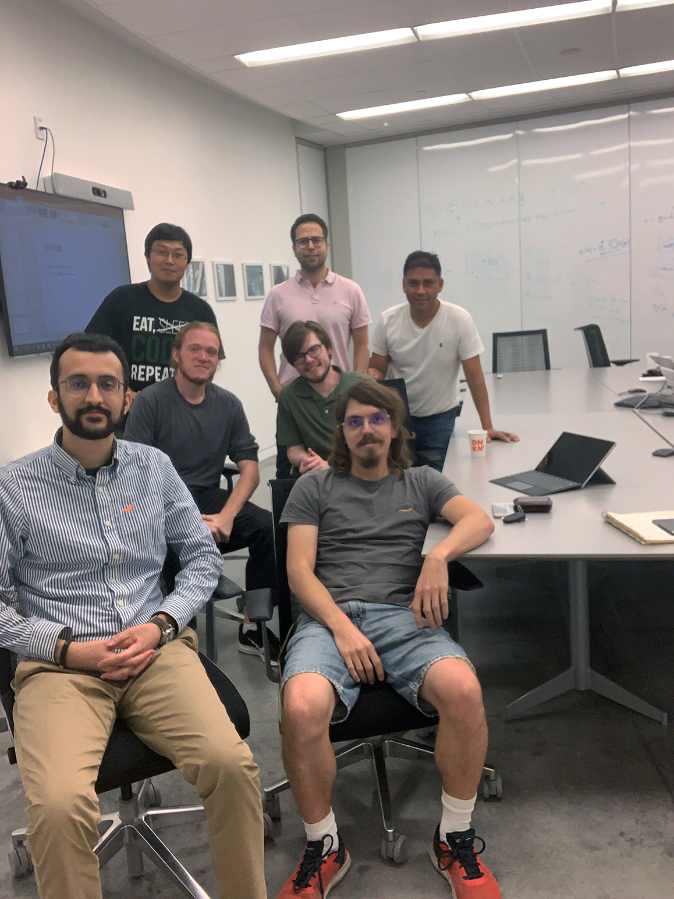

# Incentive Mechanisms for Mobile Crowdsourcing, Reaching Spatial and Temporal Coverage Under Budget Constraints

**Abstract**

Crowdsourcing is a computational paradigm to leverage the power of crowds by outsourcing the solution of a specific task. These crowds are composed of regular citizens. The potential of crowdsourcing has been proven in fields such as environmental sciences, transportation systems, and social sciences. Well-known examples include the mobile applications for the community-based traffic and navigation, which help drivers take the most efficient routes based on information provided by other drivers. Some other crowdsourced applications are the periodic measurement of environmental variables, monitoring of roads, traffic, and civil infrastructure. A crowdsourced system may be a Cyber-Physical System (CPS), which includes incentive mechanisms to encourage user participation in a given task. The typical elements of such a system are the data buyers, contributors and a platform for data storage and processing. The contributors may take the form of people who use their smartphones for data collection or autonomous vehicles with the attached sensors. These contributors have natural patterns of daily movement, which covers only specific paths in the target area at specific times. However, a sensing task may require data from all parts of the target area in different times to ensure representative sampling. Therefore, coverage in terms of both space and time may be critical for crowdsourced applications. This proposal addresses the problem of spatial and temporal coverage for sampling in a target area, in particular the coverage of isolated sub-regions where participants' density is very low. This problem is tackled by an incentive mechanism that dynamically assigns compensation for data collection in the sub-regions of the target area based on the density of the contributors in that sub-region. To achieve this goal, a sensing market is modeled using a game-theoretic approach. In the sensing market, a data buyer announces a task per sub-region and the corresponding compensation. Then, the interested participants who decide to visit that region, submit their current locations and final destinations as well as the amount of time they are willing to spend on the sensing task. Similar to any other market, the members of a CS market want to maximize their utilities. The contributors maximize their utility by strategizing their trajectories while data buyers maximize their utility by predicting the contributors' behavior and setting the optimal rewards per sub-region.

The resulting information of the proposed incentive mechanism may be leveraged by people and other rational participants such as autonomous vehicles to better plan their daily activities. For example, individuals can avoid environmental conditions that represent a risk for their health or change their daily commute to produce the lowest stress level. Other potential applications include autonomous vehicle scheduling and navigation, smart robots navigation and smart utilization of transportation resources. The proposed project will facilitate and encourage interdisciplinary collaboration among the disciplines of computer science, transportation engineering and environmental science. Specifically, interdisciplinary courses and laboratories will be developed while employing peer-to-peer Web technology, such as Wiki pages, to facilitate instant and direct access to ideas and data related to the project.

**Meet the team**


**About**

This is a simulation software for the [NSF Project](https://nsf.gov/awardsearch/showAward?AWD_ID=1739409&HistoricalAwards=false) on Mobile Crowdsourcing by Luis. G Jaimes at Florida Polytechnic University

A basic Simulation setup needs these files:

- `settings.json` - Points to the simulation's parameters, and available maps
- `participants.json` - Lists all of the participants that will exist in the smimulation, where they originate from and where they traverse to.
- `<maps>.json` - Any map needs to be detailed in a json format listing all of the nodes, and edges

## How to compile
**Python**
Project files for the python binding are generated by [Premake](https://premake.github.io/) and are defined in */simulation_module/premake5.lua*

```
workspace "NSF Simulation"
    configurations { "Debug x86", "Release x86", "Debug x64", "Release x64" }
    location "build\\SUMO"
    filter "configurations:*64"
        architecture "x64"
    configuration "vs*"
        defines { "_CRT_SECURE_NO_WARNINGS" }
    filter "configurations:Debug x64"
        targetdir "bin/x64/Debug"
        defines { "DEBUG" }
        symbols "On"
    filter "configurations:*86"
        architecture "x86"
    filter "configurations:Debug x86"
        targetdir "bin/x86/Debug"
        defines { "DEBUG" }
        symbols "On"
project "nsf"
    kind "SharedLib"
    language "C++"
    targetextension ".pyd"
    libdirs {
        "F:\\Programming\\Libraries\\boost_1_69_0\\stage\\lib",
        "F:\\Programming\\Languages\\Python\\Python34\\libs"
    }
    includedirs {
        "F:\\Programming\\Libraries\\boost_1_69_0",
        "F:\\Programming\\Work\\NSFSimulation\\simulation_module\\lib\\json\\single_include\\nlohmann",
        "F:\\Programming\\Languages\\Python\\Python34\\include"
    }
    files { 'src/simulation_module.cc', 'src/simulation_settings.cc', 'src/simulation_world.cc', 'src/simulation_node.cc', 'src/simulation_graph.cc', 'src/simulation_participant.cc', 'src/simulation_data.cc' }
    configuration "vs*"
        characterset "MBCS"
```

The includedirs and libdirs for boost, and python need to be configured to your particular project setup

**NodeJS**

With NodeJS compile the NodeJS binary with [node-gyp](https://github.com/nodejs/node-gyp)
Instead of premake5.lua for NodeJS the binding is specified in binding.gyp

## Map layout
To demonstrate a basic map layout, a simple map structure of a 3-node directed graph is presented with the following node layout
```
    0->1->2
    
    Distance from 0 to 1: 50km, Average speed: 45km/hr, Speed Deviation: 3.5km/hr
    Distance from 1 to 2: 43km  Average speed: 30km/hr, Speed Deviation: 5km/hr
```

in JSON
```
{
    "metadata":
    {
        "name": "Test"
        "author": "Jake"
        "units":
        {
            "distance": "km",
            "speed": "km/hr"
        }
    },
    "nodes":
    {
        "0":{}
        "1":{}
        "2":{}
    },
    "edges":
    {
        "0_to_1":
        {
            "distance": 50.0,
            "avgSpeed": 45.0,
            "speedDev": 3.5
        },
        "1_to_2":
        {
            "distance": 43.0,
            "avgSpeed": 30.0,
            "speedDev": 5.0
        }
    }
}
```

## To Use

To clone and run this repository you'll need [Git](https://git-scm.com) and either [Node.js](https://nodejs.org/en/download/) (which comes with [npm](http://npmjs.com)) installed on your computer, or [Python](https://www.python.org/)

```bash
# Clone this repository
git clone https://github.com/MadJayQ/NSFSimulation.git
# Go into the repository
cd NSFSimulation
# Install dependencies
npm install
# Run the test case if you're using NodeJS
node /simulation_module/test_binding.js 
#if you're using python to launch the simulation
python3 /simulation_module/test_binding.py
```

## License

[CC0 1.0 (Public Domain)](LICENSE.md)
