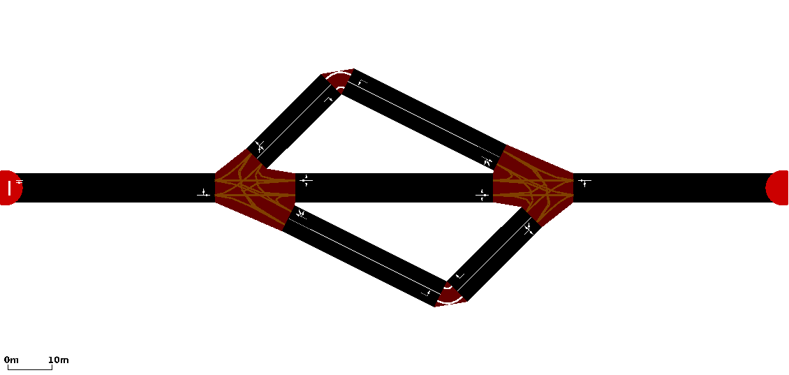
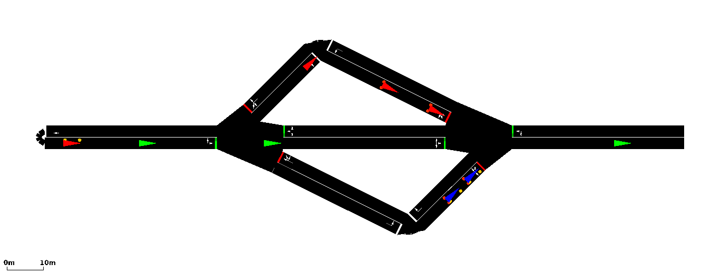
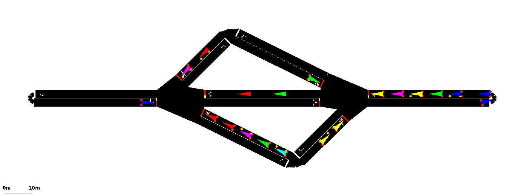

# <a name="top_of_page"></a>3choices
>Quentin: Here we have notes about the project 3choices
>
>[Projects Home](../Readme.md)

---

<!-- begin 3choices -->
### <a name="3choices"></a>3choices
[Top](#top_of_page) , [ex1.py](#3choices.ex1_py) , [ex2.py](#3choices.ex2_py) , [ex3](#3choices.ex3) , [ex4](#3choices.ex4) , [template](#3choices.template)


<br/>
Like the namesake of the project, there are three routes that a vehicle may take to get from the left to the right -- these choices are *top*, *middle*, or *bottom*.

>Quentin: This project is currently under construction.

<!-- begin ex1.py -->
#### <a name="3choices.ex1_py"></a>ex1.py

<br/>
The first example we created that used TraCI and also dynamically creates a *.rou.xml* file. Here, we use python to write routes that randomly assigns vehicles to either the routes, *top*, *middle*, or *bottom*.
>Quentin: Note that we are using python to write a *.rou.xml* file *before* we connect TraCI to SUMO and that we are not using TraCI API for route creation.

The filepath for *ex1.py* is:
```
~/src/VeinsResearch/sumo_master/projects/3choices/ex1.py
```
*ex1.py* can be run with the following command:
```
# Within the 3choices/ folder.
python3 ex1.py

# From anywhere.
python3 ~/src/VeinsResearch/sumo_master/projects/3choices/ex1.py
```
*ex1.py* has the following optional flags:
```
--nogui # default(False) - use sumo instead of sumo-gui
--debug # default(False) - verbose mode
```
Importing the SUMO python library is wordy but essential:
```
# The folder where the SUMO binaries are located
S_SUMO_TOOLS_DIR = "/home/veins/src/sumo-0.30.0/tools"

# Point python to this path.
try:
	sys.path.append(S_SUMO_TOOLS_DIR)
	from sumolib import checkBinary
	
except ImportError:
	sys.exit("Could not locate sumolib in " + S_SUMO_TOOLS_DIR + ".")
	
# And finally...
import traci
```

To connect TraCI to SUMO we must first locate where know where the *sumo* or *sumo-gui* binary is.
```
if (options.nogui):
	s_sumo_binary = checkBinary('sumo')
else:
	s_sumo_binary = checkBinary('sumo-gui')
```
Then, we have TraCI start sumo as a subprocess, which allows our TraCI python script to connect to the SUMO process which enables the use of the TraCI API.
```
# The absolute path of ex1.py
global S_ABSOLUTE_PATH

# The path to our configuration file.
s_sumocfg_path = S_ABSOLUTE_PATH + "/data/3choices.sumocfg"

# We put this together into a command.
# This is equivalent to: sumo-gui -c 3choices.sumocfg
sumo_cmd = [s_sumo_binary, "-c", s_sumocfg_path]

# Once our command is built, we have TraCI execute it.
traci.start(sumo_cmd)

# Now that SUMO is started, we can begin the TraCI control loop
run()
```
*run()* is a method we created that contains the TraCI control loop. The TraCI control loop is where the TraCI API commands go.
```
def run():
	# The current simulation step.
	n_step = 0
	
	# While there are still cars waiting to spawn.
	while traci.simulation.getMinExpectedNumber() > 0:
		
		# Perform TraCI stuff here
		
		#increment step
		n_step += 1
	
	# The simulation is over. Close and end.
	traci.close()
```
[3choices](#3choices)
<!-- end ex1.py -->
<!-- begin ex2.py -->
#### <a name="3choices.ex2_py"></a>ex2.py
[Edit #1](#3choices.ex2_py.edit1) , [Edit #2](#3choices.ex2_py.edit2)

Continuing from what we've learned from *ex1.py*, our python script *ex2.py* utilizes the TraCI API to create vehicles and assign them to routes. The differences between *ex1.py* and *ex2.py* will be explained in this section.

Run *ex2.py* with the following:
```
# Within the 3choices/ folder.
python3 ex2.py

# From anywhere.
python3 ~/src/VeinsResearch/sumo_master/projects/3choices/ex2.py
```

##### <a name="3choices.ex2_py.edit1"></a>Edit #1 - A smaller route file.
The *generate_routefile()* no longer creates vehicles, we will be doing this with the TraCI API in the TraCI control loop.

##### <a name="3choices.ex2_py.edit2"></a>Edit #2 - An improved TraCI control loop.
The *run()* method with contains the TraCI control loop is the meat of the changes between *ex1.py* and *ex2.py*
```
def run():
	# Here we initialize the variables we will be using.
	global N_VEHICLE_SPAWN_RATE
	global N_SEED
	global N_TIME_STEPS
	n_vehicles = 0
	s_vehicle_id = ""
	random.seed(N_SEED)
	
	n_step = 0
	
	# We change the condition our TraCI control loop to
	# continue until a completion time. In ex1.py, the
	# condition was to run until all vehicles from the
	# 3choices.rou.xml were created/completed, but since
	# we're creating them all with the TraCI API, we must
	# use another condition.
	while (n_step < N_TIME_STEPS):
	
		# We will create a new vehicle every 10 time steps
		if (n_step % N_VEHICLE_SPAWN_RATE == 0):
		
			# Now we randomly assign the vehicles one of the
			# three routes.
			n_random_int = random.randint(1,3)
			s_vehicle_id = "veh"+str(n_vehicles)
			
			# Top
			if (n_random_int == 1):
			
				# We can add a vehicle with traci.vehicle.add()
				traci.vehicle.add(s_vehicle_id, "top", depart=n_step+1, pos=-4, speed=-3, lane=-6, typeID="chevy_s10")
				
				# And set it's color with traci.vehicle.setColor()
				# Note that for more solid colors, use 255.
				# There are 4 parameters in the order
				# (red, blue, green, gamma)
				traci.vehicle.setColor(s_vehicle_id,(255,0,0,0))
				
			# Middle
			elif (n_random_int == 2):
				traci.vehicle.add(s_vehicle_id, "middle", depart=n_step+1, pos=-4, speed=-3, lane=-6, typeID="chevy_s10")
				traci.vehicle.setColor(s_vehicle_id,(0,255,0,0))
				
			# Bottom
			else:
				traci.vehicle.add(s_vehicle_id, "bottom", depart=n_step+1, pos=-4, speed=-3, lane=-6, typeID="chevy_s10")
				traci.vehicle.setColor(s_vehicle_id,(0,0,255,0))
				
			n_vehicles += 1 # increment vehicle counter
		# end if (n_step % N)VEHICLE_SPAWN_RATE == 0)
		
		n_step += 1
	# end while >> TraCI control Loop
	
	traci.close()
# end run()
```		

##### Method Documentation
[TraCI/Change Vehicle State wiki link](www.sumo.dlr.de/wiki/TraCI/Change_Vehicle_State#add_.280x80.29)
<br/>[traci.vehicle Python module wiki link](www.sumor.dlr.de/pydoc/traci._vehicle.html)


[3choices](#3choices)
<!-- end ex2.py -->
<!-- begin ex3 -->
#### <a name="3choices.ex3"></a>ex3
*ex3* is a cleaned up version of *ex2.py* which uses the *template* example.
We can run *ex3* with the following command:
```
# Within the 3choices/ex3/ folder.
python3 runner.py

# From anywhere.
python3 ~/src/VeinsResearch/sumo_master/projects/3choices/runner.py
```

[3choices](#3choices) , [template](#3choices.template)
<!-- end ex3 -->
<!-- begin ex4 -->
#### <a name="3choices.ex4"></a>ex4
[Step #1: Create a 1 edge route.](#3choices.ex4.step1) , [Step #2: Add some vehicles](#3choices.ex4.step2) , [Step #3: Reroute the vehicle.](#3choices.ex4.step3) , [Step #4: Handle vehicles that are nearing their destinations.](#3choices.ex4.step4) , [Notes](#3choices.ex4.notes)


<br/>
In this example we create some vehicles and assign them routes. When their routes are near completion, we flag them to be rerouted -- finally, we assign the flaged vehicles a new random route.
We can run *ex4* with the following command:
```
# Within the 3choices/ex4/ folder.
python3 runner.py

# From anywhere.
python3 ~/src/VeinsResearch/sumo_master/projects/3choices/runner.py
```

The process can be broken down into a few steps:
##### <a name="3choices.ex4.step1"></a>Step #1: Create a 1 edge route.
Before we can add any vehicles, they must have a place to go. We want to do this before the simulation starts so we add some code to our *initialize()* method.
```
traci.route.add("start",["gneE0"])
```
##### <a name="3choices.ex4.step2"></a>Step #2: Add some vehicles.
Now that we have at least one route we have someplace to add vehicles to. We perfom in the *timestep(n_step)* method. We create our vehicles with the method call:
```
traci.vehicle.add(s_vehicle_id, "start", depart=n_step+1, pos=-4, speed=-3, lane=-6, typeID="chevy_s10")
```
##### <a name="3choices.ex4.step3"></a>Step #3: Reroute the vehicle.
Vehicles now exist in the network. To perform this we created a method called *random_route(s_vehicle_id)*. An psuedo-method is described below:
```
def random_route(s_vehicle_id):
	# Change the destination of the vehicle
	traci.vehicle.changeTarget(s_vehicle_id,s_dest_edge)
	
	# We need to flag vehicles to be rerouted before they finish
	# To do this we set a stop somewhere along the destination edge.
	# We'll look for flagged vehicles and reroute them later.
	# 
	# @param pos=5.1     <-- I had some errors when this value was less than 5.1
	# @param duration=-1 <-- This means that the vehicle will be stopped forever
	#                        unless a new route is given.
	# @param until=-1    <-- -1 means unused. Specify this to start moving again
	#                        after a specified simulation time
	traci.vehicle.setStop(s_vehicle_id, s_dest_edge, pos=5.1, landeIndex=0, duration=-1, flags=0, startPos=1.0, until=-1)
	
	# Adds some color to distinguish vehicles on the various routes
	traci.vehicle.setColor(s_vehicle_id,config.lsn_colors[n_random_int])
```
##### <a name="3choices.ex4.step4"></a>Step #4: Handle vehicles that are nearing their destinations.
Once a vehicle approaches the end of it's first route, it get's flagged and stops. Now we have to handle vehicles that are stopped and tell them to go someplace else. We perform this in the *timestep(n_step)* method.
```
# First we get a list of all of the active vehicles in the simlation
ls_veh_ids = traci.vehicle.getIDList()

# Then we iterate through them and check for the ones which are stopped.
for s_veh_id in ls_veh_ids:

	# If the vehicle is stopped, it is on the ast edge of it's route and
	# needs to be assigned to another route.
	if (traci.vehcicle.isStopped(s_veh_id)):
		random_route(s_veh_id)
```
##### <a name="3choices.ex4.notes"></a>Notes
We can adjust the maximum number of vehicles in the simulaton by editing the *n_vehicles_max* value in *config.py*, a larger number will make the traffic feel more full. Reccomend vales are **20** to see the change over a large amount of vehicles at once, or **1** to see how each vehicle is affected on an atomic level.

[3choices](#3choices) , [template](#3choices.template)
<!-- end ex4 -->
<!-- begin template -->
#### <a name="3choices.template"></a>template
The *template* project was created after *ex1.py* and *ex2.py*. This project servers as a cleaner, modular template for TraCI projects and performs the neccesary tasks:
```
* Importing TraCI + SUMO python libraries.
* Addings some basic CLI flags:
	--debug adds lots of information to the console
	--nogui runs the simulation w/o the GUI (usefull for finding syntax errors)
* Builds an empty route file.
* Starts up SUMO and TraCI.
* Starts the TraCI control loop.
* Includes two functions for handy debugging:
	debug(msg) Messages to print when the --debug flag is used
	pause() Pauses the script until the Return key is pressed.
```
The *template* example consists of two files, *config.py* which keeps variables/settings that might need to be changed by the user often in one clean, organized place, and *runner.py* which is the python file that should be ran when starting the simulation.
User edits/additions should be made to the *config.py* or the bottom of *runner.py*.


[3choices](#3choices)
<!-- end template -->
<!-- end 3choices -->
