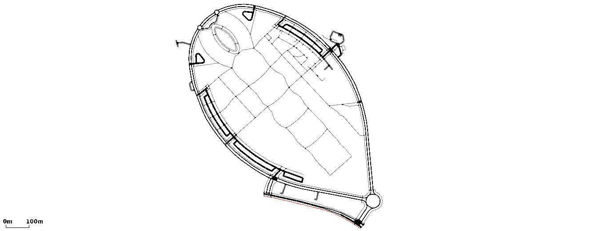
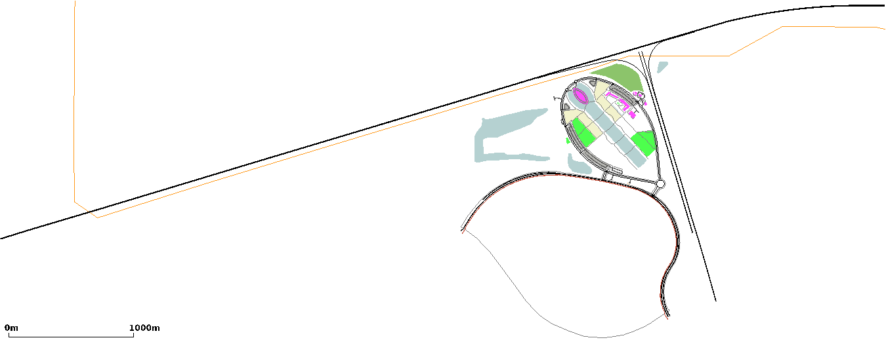
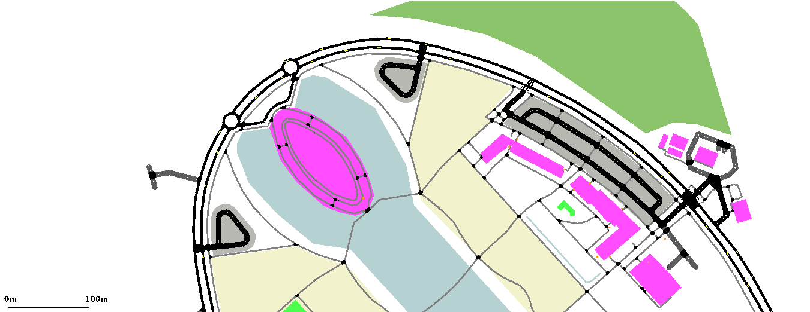

# <a name="top_of_page"></a>flpoly
[Data](#data) , [traffic1](#traffic1)
>Quentin: Here we have notes about the project *flpoly*.
>
>[Projects Home](../Readme.md)


<br/>

<br/>
This features the road layout of Florida Polytechnic University with some geometry for visual enhancement.
We ripped the map from [Open Street Maps (OSM)](https://www.openstreetmap.org/#map=16/28.1477/-81.8488) and then cleaned it up so that only the university and the relavent geometry around it remains. 
We also improved the bash script for automating the OSM to SUMO conversion process.

---
<!-- begin data -->
## <a name="data"></a>Data
[Top](#top_of_page)
<br/>
We keep two data directories within the **flpoly** project, known as [Version1](#data.version1) and [Version2](#data.version2).

<!-- begin version1 -->
### <a name="data.version1"></a>Version1
[Data](#data) , [cv_osm.sh](#data.version1.cv_osm_sh) , [osm.typ.xml](#data.version1.osm_type_xml)<br/>
<br/>
The *Version1* directory contains the OSM source, the polygon instruction file, a script to convert OSM source + polygon instructions into SUMO format and some SUMO files generated by the conversion bash script.

#### <a name="data.version1.cv_osm_sh"></a>cv_osm.sh
[Version1](#data.version1)<br/>
This is a bash script that generates SUMO files for running a project.
It is important that the OSM source and polygon instructions file be named **<project_name>.osm** and **osm.type.xml** respectively.
Simply edit the three variables at the start of the bash script with the desired project name, begin and end times and then run the script.
```
# Give the script executable permisions
sudo chmod a=x ./cv_osm.sh 

# Run the script
sudo ./cv_osm.sh
```

#### <a name="data.version1.osm_type_xml"></a>osm.type.xml
[Version1](#data.version1)<br/>
This file contains the instructions that polyconvert will use when deciding how/which polygons will be converted from OSM source to SUMO.
>Quentin: We find that some of the zoning may overlap polygons that are more interesting such as water, buildings and greenspace.
>In this case, before we cleaned up the polygons, the entirety of the university was covered by a single polygon labeled as "*amenity*".
>We disabled this polygon by adding **discard="true"** to the polygon type.
```
<polygonType id="amenity" name="amenity" color=".93,.78,.78" layer="-1" discard="true"/>
```
<!-- end version1 -->
<!-- begin version2 -->
### <a name="data.version2"></a>Version2
[Data](#data)<br/>
*Version2* is a cleaned up continuation of [Version1](#data.version1) where we removed the highways and the large lake to the west of the university.
Overall the map is cleaner and more centered on the important part of map, the university.
Notably, we added a few polygons for the parking area where there was no previous zone in Parking Lot 8.
<!-- end version2 -->
<!-- end data -->
<!-- begin traffic1 -->
## <a name="traffic1"></a>traffic1
[Top](#top_of_page) , [Route Building Logic](#traffic1.rbl)<br/>
<br/>
In this example we add some traffic to our university map.
Notably, we also developed a way to capture a partial route without having to manually select each edge individually.
>Quentin: We tried to implement pedestrians onto the map as well but we found that the auto-generated pedestrian paths are not suitable to work with pedestrians.
>Our trial code is still in the example but commented out.

### <a name="traffic1.rbl"></a>Route Building Logic
[traffic1](#traffic1)
```
# Route building Logic
if n_step < 0 : #<-- adjust this to about the timestep when the first veh
                #    should start the new route.
	ls_veh_ids = traci.vehicle.getIDList()
	for s_veh_id in ls_veh_ids:
		s_dest_edge = "370373767#0" #<-- The new destination edge
		traci.vehicle.changeTarget(s_veh_id,s_dest_edge)
		# ^-- We tell TraCI to GOTO the new edge
		
		print()
		debug(traci.vehicle.getRoute(s_veh_id))
		pause()
		#^-- TraCI spits out all the edges from it's current route + the new route
		#    to the console. Then we can copy --> paste it into runner.py
```
<!-- end traffic1 -->
