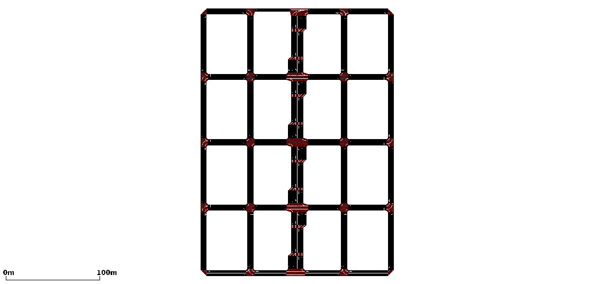

# grid
>Quentin: Here we have notes about the project grid
>
>[Projects Home](../Readme.md)

*Grid* is a square city with a four-lane highway that runs through the center. It is currently only a map file and not in use.
>Quentin: I created this map to match the prototype that Dr. Akbas and I discussed, a grid that is taller than it is wide where the center highway is wider and lets more traffic through.
>However, it does not make good use of my 1366x1766 resolution laptop monitor and I opted to make [grid2](../grid2/Readme.md) which is a similiar, more visually ergonomic edit of the city grid.
