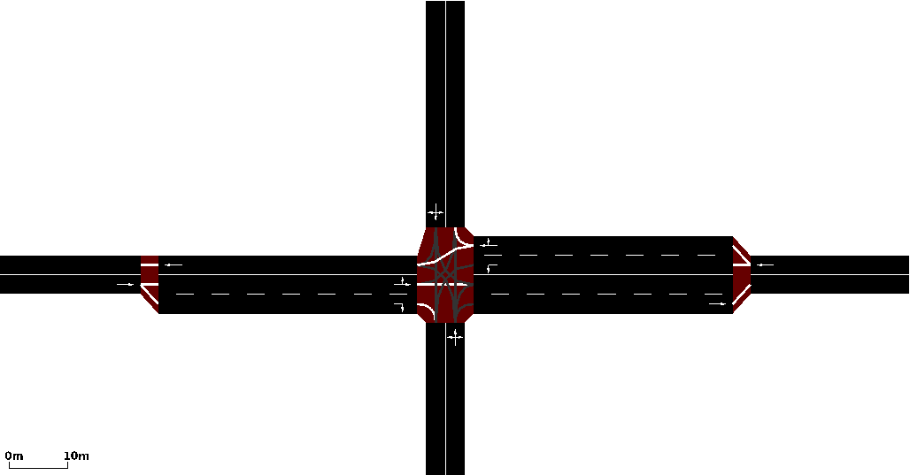

# intersection1
>Quentin: Here we have notes about the project intersection1
>
>[Projects Home](../Readme.md)

---

<!-- begin intersection_1 -->
### intersection_1
>Quentin: This project started out following the SUMO tutorial [quick start](http://sumo.dlr.de/wiki/Tutorials/quick_start) however, I ended up making my own map instead and learning how to use *netedit* that way.

 
This is the interesection of Rockridge Rd & US Hwy 98 N created usign *netedit*. It is a simple example of how edges, lanes and junctions fit together and also a good reference for learning to use *netedit*.

[netedit](../../readme.md#sumo_essentials.tools.netedit)
<!-- end intersection_1 -->
