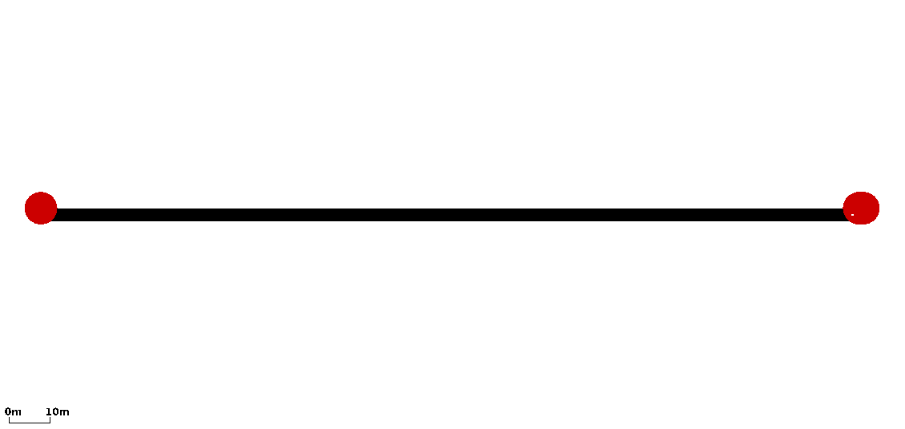

# my_first_project
>Quentin: Here we have notes about the project my_first_project
>
>[Projects Home](../Readme.md)

---

<!-- begin my_first_project -->
### my_first_project
>Quentin: This is the first project I created. It follows very closely to the SUMO tutorial [Hello Sumo](http://sumo.dlr.de/wiki/Tutorials/Hello_Sumo).

 
It is a straight line with a single vehicle that moves from one end to the other. This project is a clean simple example of the SUMO essentials.

[SUMO essentials](../../Readme.md#sumo_essentials)
<!-- end my_first_project -->
