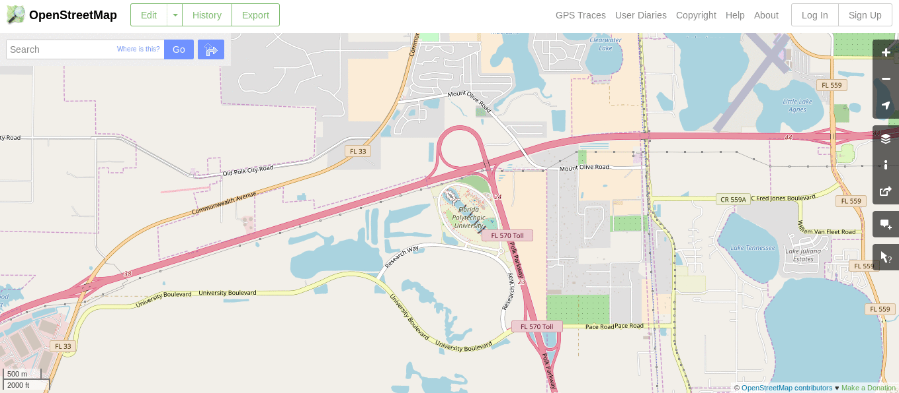
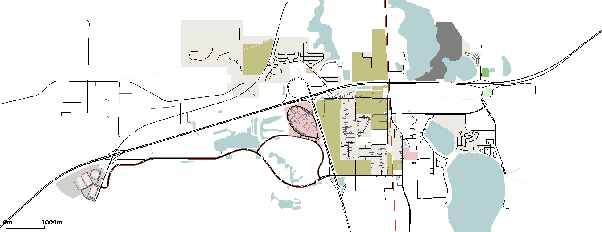
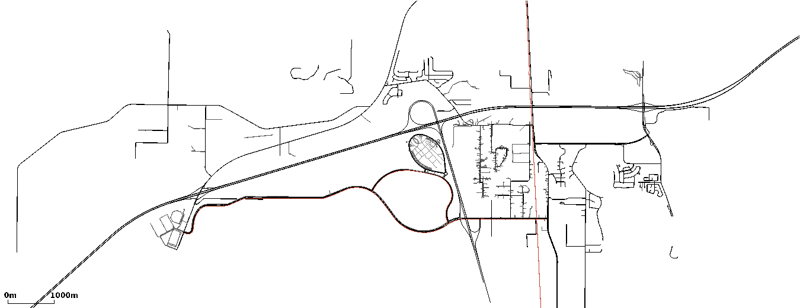

# <a name="top_of_page"></a>osm_test
[File Extensions](#file_extensions) , [Maps](#maps) , [Tools](#tools)
>Quentin: Here we have notes about the project *osm_test*.
>
>[Projects Home](../Readme.md)



This project is a compilation of various things related to converting an 
[open street maps export](https://www.openstreetmap.org/#map=14/28.1487/-81.8507)
into SUMO (and thus also able to be utilized with TraCI).

---
<!-- begin file_extensions -->
## <a name="file_extensions"></a>File Extensions
[Top](#top_of_page) , [.osm](#file_extensions.osm) , [.poly.xml](#file_extensions.poly_xml) , [.typ.xml](#file_extensions.typ_xml)<br/>
This section is about describing the notable files extensions encountered when converting an **Open Street Map (OSM)** map into a usable SUMO format.

### <a name="file_extensions.osm"></a>**.osm**
[File Extensions](#file_extensions)<br/>
The file that will be downloaded from the web browser when exporting a map from OSM will have the **.osm** extension.
There is no need to modify the **.osm** file.
It will be used as a parameter when converting with [netconvert](#tools.netconvert).

### <a name="file_extensions.poly_xml"></a>.poly.xml
[File Extensions](#file_extensions)<br/>
The output of [Netconvert](#tools.netconvert) yields a file with the extension of **.poly.xml**.
These files contain the polygon info that sumo-gui uses to contstruct polygons in it's simulation.
It is neccesary to point to the **.poly.xml** file in our **.sumoconfig** file:
```
<configuration>
	<input>
		<additional-files value="university_geo.poly.xml">
	</input>
</configuration>
```

### <a name="file_extensions.typ_xml"></a>.typ.xml
[File Extensions](#file_extensions)<br/>
We utilize a file with the **.typ.xml** extension to hold edge color information of the polygons in a [.osm](#file_extensions.osm) file.
This provides a lookup table that [Netconvert](#tools.netconvert) uses when creating a [.poly.xml](#file_extensions.poly_xml) file.
<!-- end file_extensions -->
---
<!-- begin maps --->
## <a name="maps"></a>Maps
[Top](#top_of_page) , [Geometry](#maps.geo) , [No Geometry](#maps.no_geo) <br/>
This section will describe the two maps within the project, one [without geometry](#maps.geo) and one [without geometry](#maps.no_geo).

### <a name="maps.geo"></a>Geometry
[Maps](#maps)<br/>


### <a name="maps.nogeo"></a>No Geometry
[Maps](#maps)<br/>


<!-- end maps -->
---
<!-- begin tools -->
## <a name="tools"></a>Tools
[Top](#top_of_page) , [Netconvert](#tools.netconvert) , [Polyconvert](#tools.polyconvert) <br/>
This section is the tools that are used during the conversion process of [.osm](file_extensions.osm) to multiple SUMO files.
See the [File Extensions](#file_extensions) section for more info on extentions.

### <a name="tools.netconvert"></a>Netconvert
[Tools](#tools)<br/>
We utilize the *netconvert* tool to convert a [.osm](file_extensions.osm) to a [.net.xml]([.osm]file_extensions.net_xml) file.
```
# Pseudo Code
netconvert --osm-files osm_source.osm -o output_name.net.xml \
--optimization_flags

# Actual code
netconvert --osm-files university.osm -o university.net.xml \
--geometry.remove --roundabouts.guess --ramps.guess \
--junctions.join --tls.guess-signals --tls.discard-simple --tls.join
```

### <a name="tools.polyconvert"></a>Polyconvert
[Tools](#tools)<br/>
We utilize the *polyconvert* tool to convert a [.poly.xml](#file_extensions.poly_xml) from a [.osm](#file_extensions.osm) and a [.typ.xml](#file_extensions.typ_xml) file.
```
# Pseudo Code
polyconvert --net-file net_file.net.xml \
 --osm-files osm_source.osm \
 --type-file type_file.typ.xml \
 -o output_name.poly.xml

# Actual Code
polyconvert --net-file university_geo.net.xml \
 --osm-files university.osm \
 --type-file university_geo.typ.xml \
 -o university_geo.poly.xml
```
<!-- end tools --> 
